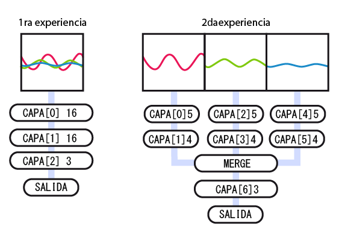

# Neural Network con Arduino y el API  funcional de Keras  
En este artículo quiero exponer los procedimientos y experiencia con redes neuronales y __Arduino__. Las redes neuronales permiten solucionar problemas de clasificación, que puedo resumir en alimentar con datos (características) y también de clases (etiqueta de las características) a una arquitectura de red neuronal (modelo) para ser entrenado y  luego, al entregarle nuevas características me devuelvan las clases correspondientes todo esto último procesado en un micro controlador.   

Para esta experiencia se recopilaron datos de movimiento asociados a ejercicio físico. Los datos son proporcionados por un acelerómetro  y son agrupados en tres tipos de ejercicios (*trote, squat, lunge*). La idea final es que el dispositivo diseñado pueda interpretar los datos (características) y determinar el ejercicio asociado a dichas características.  

  

En términos generales podemos resumir el proceso en la recopilación de datos  para luego procesarlos en una red neuronal dentro de un modelo en Keras y pasar los pesos y sesgos a un modelo reconstruido en __Arduino__.  
Se realizaron dos procedimientos: en una primera experiencia se recopilaron los datos sin procesar y fueron entrenados en un modelo con una secuencia de capas de neuronas (__Keras__). Y en otra experiencia se procesaron  los datos en tres grupos (ejes del acelerómetro) y se entrenaron en tres secuencias de capas de neuronas que luego fueron unidas en una única capa de salida(__Keras__).

  

La primera experiencia quería representar el paradigma de una red neuronal de implementación simple, además de mostrar alto desempeño para encontrar los patrones de comportamiento en datos no estructurados. Esto deviene como resultado un alto consumo de recursos del micro controlador al reconstruir el modelo de red neuronal.  
Para la segunda experiencia se implementa una arquitectura más eficiente, uso de menos recursos; en contraposición requiere mayor esfuerzo en la elaboración.  
Un desafío adicional es implementar la predicción (*forward pass*)  en un micro controlador con el sistema de Arduino. Para dicho efecto hemos usado el __ATmega644__, que nos proporciona 4 Kbytes  de memoria dinámica. Pero estos procedimientos se pueden desarrollar en un Arduino Mega (_ATmega 2560_)  o en STM32F103C8T6 (_Blue pill_), pero este último es de __32bit__, y  en la actualidad es posible correr una versión ligera de tensorflow (TensorFlowLITE). Nuestra Concepción  es implementar redes neuronales en micro controladores de __8bits__.    

|                  | RELOJ(MHz)| FLASH(kb)|SRAM(kb)|
| :--------------- | :-------: | :-------:|:------:|
| Teensy 3.2       | 72        | 256      |64      |
| Esp8266          | 80        | 4M       |96      |
| Mega             | 16        | 256      |8       |
| Pro Micro 32U4   | 16        | 32       |2.5     |
| STM32 Blue Pill  | 72        | 64       |20      |
| __Atmega644__    | 16        | 64       |4       |  


## Diferencias
En ambas ocasiones se entregaron alrededor de 500 muestras de las cuales el 20% fueron reservadas para la validación. Cada muestra tenía 15 valores, en la primera experiencia fueron organizados como fueron obtenidos del acelerómetro en un orden intercalado:  
> x1, y1, z1, x2, y2, z2, x3, y3, z3 …   

En la segunda experiencia fueron pre-procesados en tres grupos:   
> x1, x2, x3, x4, x5;  y1, y2, y3, y4, y5;  z1, z2, z3, z4, z5.  

Código en Python de la primera experiencia:  

```python
modelo.add(Dense(16, input_dim=15, activation='relu'))	# CAPA[0]
modelo.add(Dense(16, activation='relu'))    		# CAPA[1]
modelo.add(Dense(3, activation='sigmoid'))	        # CAPA[2]
```   

Código en Python de la Segunda experiencia:  
```python 
# el modelo
input_tensor_1 = tf.keras.layers.Input(shape=(5,))
input_tensor_2 = tf.keras.layers.Input(shape=(5,))
input_tensor_3 = tf.keras.layers.Input(shape=(5,))

# primera entrada
a = tf.keras.layers.Dense(5, activation='relu', name='capa_1X')(input_tensor_1)
a = tf.keras.layers.Dense(4, activation='relu', name='capa_2X')(a)

# 2da entrada
b = tf.keras.layers.Dense(5, activation='relu', name='capa_1Y')(input_tensor_2)
b = tf.keras.layers.Dense(4, activation='relu', name='capa_2Y')(b)

# 3ra entrada
c = tf.keras.layers.Dense(5, activation='relu', name='capa_1Z')(input_tensor_3)
c = tf.keras.layers.Dense(4, activation='relu', name='capa_2Z')(c)

# unir las tres ramas
merge = tf.keras.layers.concatenate([a, b, c])

output_tensor = tf.keras.layers.Dense(3, activation='sigmoid', name='salida')(merge)

```  

Código en arduino de la  primera experiencia:

``` c
float NeuralNetwork() {
  // cálculo de la capa 0:
  Matrix<1, 16> suma0 = (test_ * WL0_) + BL0_;//f((x*W)+B)
  // función de activación:
  for (int i = 0; i < 16; i++) {
    salida0[0][i] = relu(suma0(0, i));
  }
  salida0_ = salida0;
  // cálculo de la capa 1:
  Matrix<1, 16> suma1 = (salida0_ * WL1_) + BL1_;
  // función de activación:
  for (int i = 0; i < 16; i++) {
    salida1[0][i] = relu(suma1(0, i));
  }
  salida1_ = salida1;
  // cálculo de la capa 2:
  Matrix<1, 3> suma2 = (salida1_ * WL2_) + BL2_;
  // función de activación:
  for (int i = 0; i < 3; i++) {
    salida2[0][i] = sigmoid(suma2(0, i));
  }
  salida2_ = salida2;
  // imprimir resultado
  Serial << "Matrix de salida: " <<  salida2_* mult_val  << '\n';

}
```

Código en arduino de la  segunda experiencia:  


``` c
float NeuralNetwork() { 
  //------ cálculo para datos X ------
  Matrix<1, 5> suma0 = test_x_ * WL3_ + BL3_; //<-- X*W+b
  for (int i = 0; i < 5; i++) {
    salida0[0][i] = relu(suma0(0, i)); //<--función de activación
  }
  salida0_ = salida0;
  Matrix<1, 4> suma1 = salida0_ * WL6_ + BL6_;
  for (int i = 0; i < 4; i++) {
    salida1[0][i] = relu(suma1(0, i)); //<--función de activación
  }
  salida1_ = salida1;
  //------cálculo para datos Y ------
  Matrix<1, 5> suma3 = test_y_ * WL4_ + BL4_;
  for (int i = 0; i < 5; i++) {
    salida2[0][i] = relu(suma3(0, i)); //<--función de activación
  }
  salida2_ = salida2;
  Matrix<1, 4> suma4 = salida2_ * WL7_ + BL7_;
  for (int i = 0; i < 4; i++) {
    salida3[0][i] = relu(suma4(0, i)); //<--función de activación
  }
  salida3_ = salida3;
  //------cálculo para datos Z ------
  Matrix<1, 5> suma5 = test_z_ * WL5_ + BL5_;
  for (int i = 0; i < 5; i++) {
    salida4[0][i] = relu(suma5(0, i)); //<--función de activación
  }
  salida4_ = salida4;
  Matrix<1, 4> suma6 = salida4_ * WL8_ + BL8_;
  for (int i = 0; i < 4; i++) {
    salida5[0][i] = relu(suma6(0, i)); //<--función de activación
  }
  salida5_ = salida5;  
  //-------------- Concatenar  -----------
  Matrix<1,8> conct1 = HorzCat(salida1_,salida3_); // una a la vez
  Matrix<1,12> concatAll = HorzCat(conct1,salida5_);
  Matrix<1, 3> suma7 = concatAll * WL10_ + BL10_;
  Matrix<1, 3> mult = concatAll * WL10_;
  for (int i = 0; i < 3; i++) {
    salida[0][i] = sigmoid(suma7(0, i)); //<--función de activación
  }
  salida_ = salida;
  //-------------- Salida Final  -----------
  Serial << "|   " <<  salida_(0,0)*mult_val <<"  "<<salida_(0,1)*mult_val <<"  "<< salida_(0,2)*mult_val ;  
}
```


Luego tenemos las diferencias estructurales de los modelos: Es evidente que casi se duplican las capas procesadas, así como también es la complejidad del modelo. Cada rama de la segunda experiencia  se diferencia de la primera tan solo en el número de neuronas. Finalmente se evidencia la aparición de la capa Merge que técnicamente se denomina Concatenar.  

  

Las diferencias en las operaciones y recursos de los modelos. Si bien en la precisión existen pocas diferencias, es el uso de la memoria dinámica (SRam) el ahorro de recursos más evidentes.

|                  | 1RA       | 2DA      |
| :--------------- | :-------: | :-------:|
| Parámetros       | 579       | 201      |
| Épocas           | 300       | 250      |
| Exactitud        | 97.8%     | 100%     |
| Perdida          | 0.06      | 0.02     |
| Flash usado < sup > 1 < / sup > | 25.3 Kb   | 25.2 kb  |
| SRam usado < sup > 1 < / sup >  | 8.7 Kb    | 6 kb     | 


Para finalizar les muestro los resultados de la segunda experiencia en comparación con las etiquetas esperadas:

``` text 

|------------------------|-----------|
|      predic labels     |   real    |
|------------------------|-----------|
|   0.00  0.02  0.61     |  0  0  1  |
|   0.00  0.00  0.24     |  0  0  1  |
|   0.00  0.02  1.34     |  0  0  1  |
|   1.12  0.04  0.00     |  1  0  0  |
|   21.38  0.08  0.00    |  1  0  0  |
|   0.00  0.01  0.00     |  0  1  0  |
|   0.00  0.07  0.00 	 |  0  1  0  |
|   0.00  0.00  0.13 	 |  0  0  1  |
|   26.39  0.05  0.00    |  1  0  0  |
|   0.00  0.02  0.93     |  0  0  1  |
|------------------------|-----------|

```  

El valor de estas experiencias de reflejan en la posibilidad de construir modelos más complejos que se adapten  a problemas específicos además de establecer los procedimientos para integrar los resultados de entrenamiento desarrollados en __Keras__ y  la reconstrucción del modelo con el lenguaje de __Arduino__.  

***
< sup > 1 < / sup >Para efecto de la comparación se uso el STM32F103C8T6 (Blue pill) 


